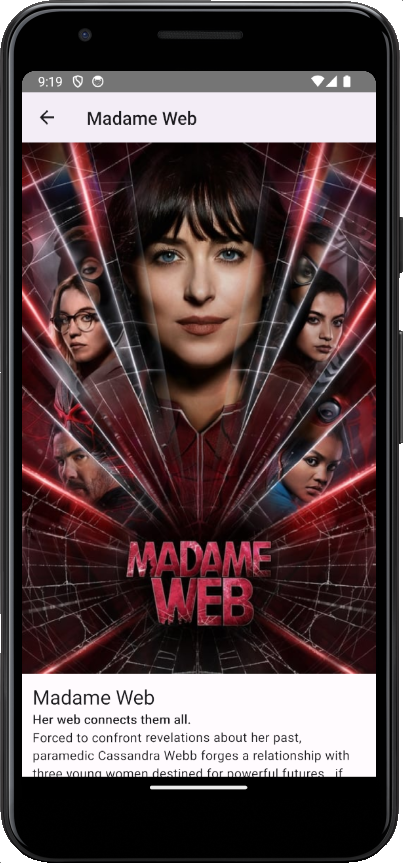

# MovieDBApp



This is a personal project created by [@edmundito](/edmundito) to freshen up on React Native and TypeScript. It's an example React Native app that pulls information from [TMDB](https://themoviedb.org/).

## Getting Started

### Step 1: Start the Server

```bash
npm start
```

### Step 2: Start the Application

#### For Android

```bash
npm run android
```

#### For iOS

```bash
npm run ios
```
